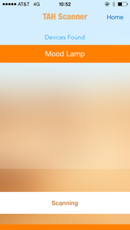

### Tah-RGB

Make a mood lamp and change the lighting on a bunch of RGB LEDs with the Tah RGB app! Set up RGB LEDs in any pattern you like and connect them to the Tah. You can then use your phone to have the LEDs light up according to the colours of your choice or cycle through the selected colours in a rainbow mode.

This repository consists of the iOS and Android(coming soon) source code along with the corresponding Arduino sketch for the Tah RGB app.  

   
<a href="https://itunes.apple.com/us/app/tah-rgb/id925250365?mt=8"></img></a>

---

## Usage

#### Arduino
* Install the
[Tah Arduino Library](https://github.com/tah-io/Tah_Arduino_Library#installing)
* Download the
[RGB sketch](https://raw.githubusercontent.com/tah-io/Tah-RGB/master/RGB/RGB.ino)
and open it in the Arduino IDE
* Upload it on your Tah board

#### iOS
* Clone the repo

		git clone https://github.com/tah-io/Tah-RGB.git

* Change directory to the appropriate submodule (iOS or Android)

		cd Tah-RGB-iOS

* Initialize and update the submodule

		git submodule init
		git submodule update
* Open the Xcode project file TAH.xcodeproj 

